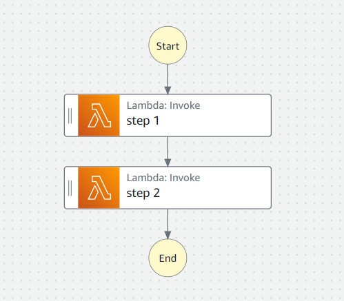
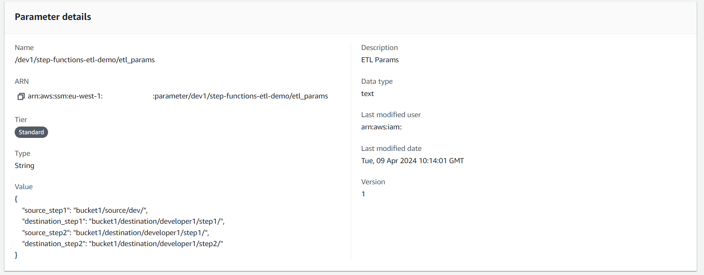

<!--
title: 'ETL Step Functions Example'
description: 'This template demonstrates how to deploy a multi-step ETL job using Step Functions using the Serverless Framework.'
layout: Doc
framework: v3
platform: AWS
language: python
priority: 2
authorLink: 'https://github.com/serverless'
authorName: 'Mark Hodnett'
authorAvatar: 'https://avatars1.githubusercontent.com/u/13742415?s=200&v=4'
-->


# Step Functions ETL Demo

This template demonstrates how to deploy a multi-step ETL job using Step Functions using the Serverless Framework. It also allows for multiple developers to work concurrently on different steps in the pipeline using stages. Each developer can deploy the stack independently, and their changes will not impact on other developers. Each deployment uses AWS Systems Manager Parameter Store to manage its parameters. In this example, we use it to store the source and destination locations for the data for each step in the pipeline.  
When deployed, this project creates the following resources:  
 - One Step Function
 - Two Lambda functions
 - One set of parameters in AWS Systems Manager Parameter Store
 - One Role to allow the Lambda functions to access the parameters

The Step Function has two steps:  


The parameter store config information, in this scenario it would be S3 locations:  



## Usage

### Deployment

In order to deploy the example, you need to run the following command:

```
$ serverless deploy --stage dev1
```

After running deploy, you should see output similar to:

```bash
Deploying step-functions-etl-demo to stage dev1 (eu-west-1)
✔ State machine "step_job" definition is valid

✔ Service deployed to stack step-functions-etl-demo-dev1 (78s)

functions:
  step1: step-functions-etl-demo-lambda-step1-dev1 (813 B)
  step1: step-functions-etl-demo-lambda-step2-dev1 (799 B)
```


### Creating the stacks and testing the functionality

Once you have deployed to stage ```dev1```, it creates a step function for that stage called ```etl-job-step-function-dev1```. You can invoke the step function by using the following command:

```bash
aws stepfunctions start-execution --state-machine-arn arn:aws:states:eu-west-1:XXXXXXXXX:stateMachine:etl-job-step-function-dev1 --input '{}'
```
note: You must swap the XXXXXXXXX with the AWS account name. Alternatively, you can get the State Machine's ARN from the console

Which should result in response similar to the following:
```json
{
    "executionArn": "arn:aws:states:eu-west-1:XXXXXXXXX:execution:step-functions-etl-demo-step-function-dev1:11111111-2222-3333-4444-555555555555",
    "startDate": "2024-04-09T10:23:03.325000+00:00"
}
```

You can then see the results by taking the value for executionArn from above and copying into this command
```bash
aws stepfunctions describe-execution --execution-arn {executionArn}
```
e.g.
```bash
aws stepfunctions describe-execution --execution-arn arn:aws:states:eu-west-1:XXXXXXXXX:execution:step-functions-etl-demo-step-function-dev1:11111111-2222-3333-4444-555555555555
```
This should produce output similar to this:
```json
{
    "executionArn": "arn:aws:states:eu-west-1:XXXXXXXXX:execution:step-functions-etl-demo-step-function-dev1:11111111-2222-3333-4444-555555555555",
    "stateMachineArn": "arn:aws:states:eu-west-1:XXXXXXXXX:stateMachine:step-functions-etl-demo-step-function-dev1",
    "name": "64c84688-d97e-4277-b1e7-5a46e39112a5",
    "status": "SUCCEEDED",
    .........
    "inputDetails": {
        "included": true
    },
    "output": "\"Step=1, STAGE=dev1, Data Source=bucket1/source/dev/, Data Destination=bucket1/destination/developer1/step1/. Step=2, STAGE=dev1, Data Source=bucket1/destination/developer1/step1/, Data Destination=bucket1/destination/developer1/step2/\"",
    ........
}
```

The output contains the source and destination for the two steps in the process. The first Lambda function would have read and written data to these locations:
 - Data Source=bucket1/source/dev/  
 - Data Destination=bucket1/destination/developer1/step1/  

The second Lambda function would have read and written data to these locations:
 - Data Source=bucket1/destination/developer1/step1/  
 - Data Destination=bucket1/destination/developer1/step2/  


### Deploying to a second stage for an additional developer

A second developer could also deploy the stack and it would create a complete new set of resources for that developer. They could change their parameters and therefore work on different data and / or a different Lambda function to the first developer. They could do this be editing the file in params/dev2-etl-params and deploying it to a new stage:
```
$ serverless deploy --stage dev2
```

After this, there would be new step functions, 2 new Lambda functions, 1 new roles and 1 new parameter values deployed. The second developer could then make changes to either Lambda function and test the changes without impacting on developer 1. For example, if they ran
```bash
aws stepfunctions start-execution --state-machine-arn arn:aws:states:eu-west-1:XXXXXXXXX:stateMachine:etl-job-step-function-dev2 --input '{}'
```
and then 
```bash
aws stepfunctions describe-execution --execution-arn arn:aws:states:eu-west-1:XXXXXXXXX:execution:step-functions-etl-demo-step-function-dev2:66666666-7777-8888-9999-000000000000
```
then, they should see output similar to this:
```json
{
    "executionArn": "arn:aws:states:eu-west-1:XXXXXXXXX:execution:step-functions-etl-demo-step-function-dev2:11111111-2222-3333-4444-555555555555",
    "stateMachineArn": "arn:aws:states:eu-west-1:XXXXXXXXX:stateMachine:step-functions-etl-demo-step-function-dev2",
    "name": "64c84688-d97e-4277-b1e7-5a46e39112a5",
    "status": "SUCCEEDED",
    .........
    "inputDetails": {
        "included": true
    },
     "output": "\"Step=1, STAGE=dev2, Data Source=bucket1/source/dev/, Data Destination=bucket1/destination/developer2/step1/. Step=2, STAGE=dev2, Data Source=bucket1/destination/developer2/step1/, Data Destination=bucket1/destination/developer2/step2/\"",
    ........
}
```

The output contains the source and destination for the two steps in the process. The first Lambda function would have read and written data to these locations:
 - Data Source=bucket1/source/dev/  
 - Data Destination=bucket1/destination/developer2/step1/  

The second Lambda function would have read and written data to these locations:  
 - Data Source=bucket1/destination/developer2/step1/  
 - Data Destination=bucket1/destination/developer2/step2/  

Note the difference in the paths here. The second developer has full control over the code and the data that they use. 


## Cleanup
When done, run ```serverless remove``` for each stage you deployed, e.g.
```
$ serverless remove --stage dev1
$ serverless remove --stage dev2
```
